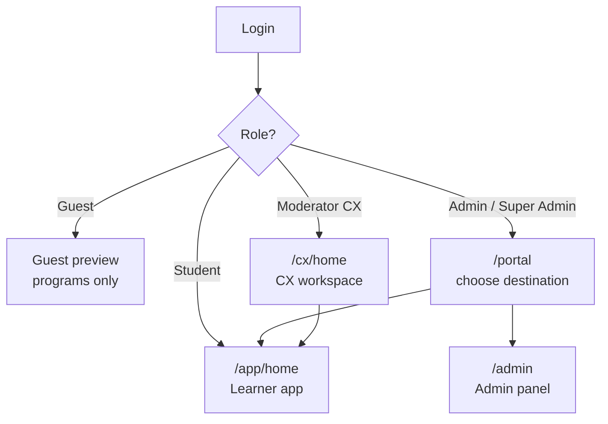
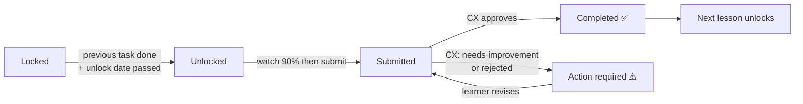
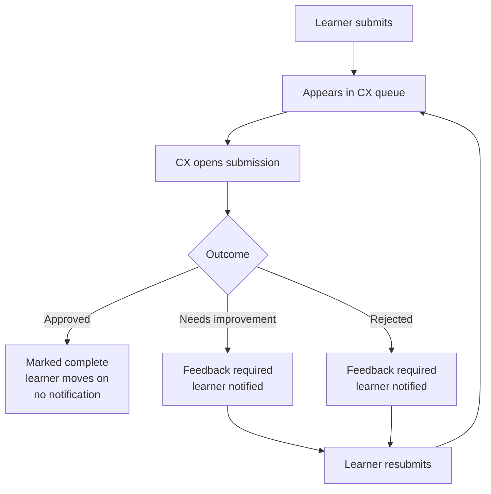

# Iron Lady LMS — Feature & Review Guide

**Purpose:** a complete walkthrough of every feature in the LMS, written so a reviewer can open the app, follow along screen by screen, and confirm everything works.

**How to use it:** work through Parts 1–5 in order. Each screen tells you *where to go*, *what you should see*, and *what to try*. Tick the sign-off checklist at the end.

---

## Before you start

### Accounts you'll need

| Role | What it's for | How to get one |
|---|---|---|
| **Guest** | Signed-out preview | Just open the app without logging in |
| **Learner (student)** | The main experience | Any enrolled learner account |
| **CX (moderator)** | Review + batch management | Admin sets role to *Customer Expression* and picks a program |
| **Admin** | Platform management | Set by a Super Admin |
| **Super Admin** | Storage, user deletion | Existing Super Admin account |

> **Important:** to review the learner journey properly you need a learner enrolled in **at least one program**, ideally one with submitted work so the review flow can be seen end to end.

### Where to run it

- **Local:** `npm run dev` → http://localhost:5173
- **Live:** your deployed URL

---

## The five roles at a glance

| | Guest | Learner | CX | Admin | Super Admin |
|---|---|---|---|---|---|
| Browse programs (preview) | ✅ | ✅ | ✅ | ✅ | ✅ |
| Open enrolled programs | ❌ | ✅ | ✅ | ✅ | ✅ |
| Review submissions | ❌ | ❌ | ✅ | ✅ | ✅ |
| See **all** batches | ❌ | ❌ | ❌ (only assigned) | ✅ | ✅ |
| Switch program in CX | ❌ | ❌ | ❌ (locked to theirs) | ✅ | ✅ |
| Manage users / courses | ❌ | ❌ | ❌ | ✅ | ✅ |
| Delete users, manage storage | ❌ | ❌ | ❌ | ❌ | ✅ |

> **Note:** program unlocking is based **only on enrolment** — not on role. An Admin still sees only *their own* enrolled programs in the learner app.

---

## Part 1 — Guest experience

**Go to:** the app URL, signed out.

**What you should see**
- Marketing banner carousel (auto-advancing)
- A lock notice: *"Journey order: LEP → 100BM → MBW. Sign in to open your enrolled track."*
- Three static program cards (LEP, 100BM, MBW), each with **Sign in to continue**
- No real data anywhere — no fake numbers, no invented names

**What to try**
- Swipe / tap arrows / tap dots on the carousel
- Open **Progress**, **Calendar**, **Support** → each shows a *"… locked"* panel
- Confirm the notification bell does **not** appear

> 📸 **Screenshot:** `docs/screenshots/01-guest-home.png` — guest home with the locked notice and three program cards

---

## Part 2 — Learner experience

### 2.1 The shell (visible on every screen)

**Top header:** Iron Lady logo, streak ring (fills toward the learner's personal best), theme toggle, notification bell with unread badge, and — only for staff accounts — an Admin/CX shortcut.

**Bottom nav (5 tabs):** Home · Calendar · Progress · Support · Profile

> MBW and 100BM are **not** in the bottom nav — they're opened from cards on Home and Progress.

**What to try**
- Toggle **light/dark** and confirm both are readable
- Open the notification bell → it opens as a **bottom sheet** on mobile, a dropdown on desktop
- Dismiss one notification with **×**, and on mobile **swipe left** to dismiss
- Press **Escape** to close the sheet

> 📸 **Screenshot:** `docs/screenshots/02-learner-header-notifications.png` — notification sheet open

#### Notification types (5)
| Kind | Triggered by | Where it goes |
|---|---|---|
| **News** | Announcements (adds "You're tagged") | Home |
| **Review** | CX reviewed your task | Straight to that lesson |
| **Event** | Upcoming calendar event | That date in the calendar |
| **Support** | Your open ticket | Support |
| **Support (assigned)** | Ticket assigned to staff | Support |

---

### 2.2 Home — `/app/home`

**What you should see (top to bottom)**
1. Banner carousel
2. Greeting hero — time-aware ("Good morning/afternoon/evening"), first name, program badge, tagline
3. Quick stats — Open programs · Pending assignments · Upcoming events · Recent actions
4. **Continue learning** card — resumes the highest program you're enrolled in, with a milestone bar
5. **Schedule** — next 4 events, each with *Google Calendar* and *Open link*
6. **Your programs** — cards sorted enrolled-first, then LEP → 100BM → MBW
7. Announcements feed
8. Last activity (3 items)
9. Pending assignments
10. Your progress — streak, heatmap, attendance

**What to try**
- Click **Continue learning** → lands on the right next task
- Confirm locked programs still appear, marked *Upcoming* or *Locked*, with **View program** linking to the public marketing page
- Add an event to Google Calendar

> 📸 **Screenshot:** `docs/screenshots/03-learner-home.png` — full dashboard

---

### 2.3 Progress — `/app/progress`

**What you should see**
- 4 clickable stats (Programs, Overall %, Resources, Streak) — each scrolls to its section
- **MBW progress panel** — big % ring, "N of M milestones", "Up next", **Continue to study**, plus sub-rings for *Lesson videos* and *Assignments*
- Enrolled programs with % bars
- **Resources** with a per-program filter, each Open (new tab) or Locked
- Activity log (last 30, enrolled programs only)
- Streak summary — Current / Best / Submissions

**What to try**
- Click each stat and confirm it scrolls
- Filter resources by program
- Click **Continue to study** → resumes at the exact next task

> 📸 **Screenshot:** `docs/screenshots/04-learner-progress.png`

---

### 2.4 Calendar — `/app/calendar`

**What you should see**
- Colour legend: Class/Session · Deadline · Meeting · General
- **Agenda** and **Month** toggle — defaults to *Agenda on mobile*, *Month on desktop*
- Month grid with up to 2 event chips per day plus "+N more"
- Selected-day sidebar with image, type badge, time, description

**What to try**
- Switch Agenda ↔ Month; resize the window and confirm the default follows the viewport
- Tap a day → sidebar loads that day
- **Google Calendar** and **Open link** buttons
- Deep link: `/app/calendar?date=2026-08-01` should jump and select that date

> 📸 **Screenshot:** `docs/screenshots/05-learner-calendar.png`

---

### 2.5 Support — `/app/support`

**What you should see**
- **Create a ticket** — Category, Subject, Message (all required)
- **My tickets** — list plus a message thread, with learner vs staff messages styled differently

**What to try**
- Raise a ticket → it auto-selects
- **Edit** and **Delete** (only available while status is *Open*)
- Send a reply
- Confirm a **Resolved** ticket hides the reply box and shows the resolved note

> 📸 **Screenshot:** `docs/screenshots/06-learner-support.png`

---

### 2.6 Profile — `/app/profile`

- **Your identity** — editable display name; email and role read-only
- **Preferences** — theme toggle
- **Workspaces** — only for staff accounts (Super Admin / CX / Admin shortcuts)
- **Help & support** → Support
- **Sign out** — with a confirm dialog

> 📸 **Screenshot:** `docs/screenshots/07-learner-profile.png`

---

### 2.7 Course detail — `/app/course/:id`

- Hero: cover, program tag, **Enrolled** chip, duration/format, progress bar
- **Your CX contacts** — real moderators only; renders nothing if none assigned (no placeholder people)
- **How it works** — 4 steps; MBW version explains the 90% watch rule and CX review
- MBW only: full program journey inline, progress rings, upcoming events
- **Session recordings** — your batch's recordings grouped by phase
- **Lesson resources** — Open (logs an activity) or Locked

> 📸 **Screenshot:** `docs/screenshots/08-course-detail.png`

---

### 2.8 MBW program — `/app/mbw`

Two modes: **Overview** and **Lesson** (`?lesson=<id>`).

**Overview**
- Hero: "1 year", cohort label, progress band, **Next up**, **Resume**
- First-time panel for new learners
- **Your journey** — 8 sections, each with a gold progress ring and Start/Continue/Review:

| Section | Content | Gate |
|---|---|---|
| Pre-Preparation | 12 lessons | Open |
| Quarter 1 | 17 lessons (Wk1–12) | — |
| Quarter 2 | 17 lessons (Wk13–24) | After Q1 + paid |
| Quarter 3 | 17 lessons (Wk25–36) | After Q2 + paid |
| Quarter 4 | 17 lessons (Wk37–48) | After Q3 + paid |
| Graduation | 5 lessons (Wk49–52) | After Q4 + paid |
| Monthly Session Recordings | Batch recordings | Batch |
| C-Suite League Community | Discussions | Membership |

- **My submissions** archive (collapsible)
- Amber **sync warning** if work saved device-only, with **Retry sync**

**Lesson mode**
- Topbar with **Outline** button → full-screen curriculum drawer
- The task itself (see 2.10)
- Sticky footer: **Previous** / **Next lesson** (only once complete), plus a "Lesson saved" banner

> 📸 **Screenshots:** `docs/screenshots/09-mbw-overview.png`, `docs/screenshots/10-mbw-lesson.png`

---

### 2.9 100BM program — `/app/100bm`

Same structure as MBW, with these differences:
- "6 months", boardroom framing
- Sections: Onboarding → Phase 1 Foundation → Phase 2 Pitch & Strategy → Phase 3 Board Ready → Phase 4 Challenges → Graduation
- Section headers use a **status dot + done/total**, with a **padlock** on payment-gated phases
- **Payment gating is prominent** — a banner explains registration access covers Onboarding + Phase 1 only, and the hero CTA becomes **Payment support**
- Adds a **Session materials** block (resource links + template downloads)

> 📸 **Screenshot:** `docs/screenshots/11-100bm-overview.png` — ideally showing the payment-gated phase

---

### 2.10 The 8 task types

| # | Type | What the learner does |
|---|---|---|
| 1 | **Watch only** | Watch to 90% — auto-completes |
| 2 | **Text** | Write into a textarea; optional template downloads |
| 3 | **Link** | Paste a URL; validated before submit |
| 4 | **ERRC template** | Eliminate/Reduce/Raise/Create grid — cards on mobile, table on desktop. Stays editable |
| 5 | **File upload** | Pick a file; progress bar + **Cancel upload**; optional tasks can be skipped |
| 6 | **Video record** | Record in-app (5 min cap, live timer) or upload (200 MB cap); retake; progress + cancel |
| 7 | **Recurring post** | Paste a weekly post link; shows "N / M posts" and past weeks |
| 8 | **Checklist** | Tick items — auto-saves each toggle; completes at 100% |

**What to try:** at minimum submit a **text**, a **link**, and a **file upload** so you see the progress bar and cancel button.

> 📸 **Screenshots:** `docs/screenshots/12-task-video-gate.png`, `docs/screenshots/13-task-errc.png`, `docs/screenshots/14-task-upload-progress.png`

---

### 2.11 How unlocking works

**Three rules worth testing**
1. **90% watch gate** — the submission form stays disabled until the video hits 90%. YouTube videos can't be tracked, so they show an *"I finished watching"* button instead.
2. **Sequential unlock** — a lesson opens only when the previous one is done (or optional).
3. **Sent back = not done** — a task marked *needs improvement* or *rejected* stops counting as complete, **re-locks the next lesson**, and becomes the learner's resume target again.

---

### 2.12 Review feedback (learner side)

| CX outcome | Learner sees | Colour |
|---|---|---|
| Approved | **Approved** | Green |
| Needs improvement | **Action required** | Amber |
| Rejected | **Action required** | Red |

Appears as a **Review feedback** block at the bottom of the task, with the CX note and the review date. When action is required, the form reopens for resubmission and a notification is sent.

> 📸 **Screenshot:** `docs/screenshots/15-learner-review-feedback.png`

---

### 2.13 Locked and blocked states

- **Guest locked panel** — lists the four locked areas plus a contact link
- **Program locked panel** — *Upcoming in your journey* vs *Access restricted*, with **Speak to our Counsellor**
- **Blocked account** — replaces the whole app; auto-restores within 30s once an admin unblocks

> 📸 **Screenshot:** `docs/screenshots/16-program-locked.png`

---

## Part 3 — CX (Customer Expression) workspace

**Go to:** `/cx/home` — 5 tabs: Home · Analytics · Batches · Reviews · Profile

**Scoping — test this first.** A CX moderator sees **only batches where they are the lead**, and is **locked to one program** (static badge in the header). An Admin sees **all batches** and gets a **program switcher dropdown**.

### 3.1 CX Home — `/cx/home`
- Greeting hero + Refresh
- KPIs: Participants · Needs attention · Tasks completed %
- **Needs your attention** — up to 8 submissions, resubmit-first then oldest-first
- **Your batches** sidebar
- **Remind** on a batch → session reminder modal (optional message)

> 📸 `docs/screenshots/17-cx-home.png`

### 3.2 Reviews — `/cx/reviews`
- Filters: **All submissions** · **Needs review** · **Awaiting resubmit** (with counts)
- Batch filter dropdown
- Rows: learner, task, batch · time ago, status pill
- **Remind** on action-required rows

> 📸 `docs/screenshots/18-cx-reviews.png`

### 3.3 Task review — the core workflow

**What you should see:** the learner's actual submission rendered read-only — text, link, file download, inline video/audio player, ERRC table, weekly posts, or checklist.

**What to try**
1. Approve one → banner says the learner can continue; **no** notification is sent
2. Try *Needs improvement* **without** feedback → blocked with *"Add feedback so the learner knows what to improve."*
3. Add feedback and save → learner is notified
4. Log in as that learner → confirm **Action required**, the next lesson re-locked, and resubmission works

> ⚠️ **This is the single most important flow to test end to end.**

> 📸 `docs/screenshots/19-cx-task-review.png`

### 3.4 Batches — `/cx/batches`
- **New batch** — name + description; creator is auto-added as lead (this is what keeps it visible to them)
- Table: Batch · Description · Members · Manage

### 3.5 Batch detail — `/cx/batches/:id`
- **Manage batch** — edit name/description, **Add learner**, **Move to…**, **Remove**; *Delete batch* is **admin-only**
- **Session recordings by phase** — paste unlisted YouTube/Drive/Zoom links per session; shows uploaded/total coverage; warns before replacing an existing video
- **Stat cards** (clickable → participant list): Enrolled · Active 7d · Active 30d · Never active · All tasks done · Completion %
- **Attendance** (only when courses are linked to the batch in Admin): Average · Have records · Good ≥80% · At risk <60%
- **Completion by module** with clickable done/pending counts
- **Learners list** — last active, tasks x/y, attendance %

> 📸 `docs/screenshots/20-cx-batch-detail.png`, `docs/screenshots/21-cx-recordings.png`

### 3.6 Analytics — `/cx/dashboards`
KPI strip: Participants · Active 7d · Batches · Task completion % · Pending reviews · Awaiting resubmit · Session videos · Avg attendance

Three tabs:
- **Overview** — 4 charts: Cohort journey · Payment status · Participant activity · Task completion donut. **Every segment is clickable** and opens the participant list; there's also a keyboard-accessible legend.
- **By batch** — batches table with progress
- **By task** — completion by batch chart + task-by-task breakdown with clickable counts

> 📸 `docs/screenshots/22-cx-analytics.png`, `docs/screenshots/23-cx-drilldown.png`

### 3.7 CX vs Admin — differences to verify

| Capability | CX moderator | Admin |
|---|---|---|
| Batches visible | Only theirs | All |
| Program | Locked (static badge) | Switcher dropdown |
| Delete batch | Hidden | Visible |
| Cross-program enrolment bar | Hidden | Visible |
| Header link | "LMS" | "Admin" |

---

## Part 4 — Admin panel

**Go to:** `/portal` → **Open admin section**, or `/admin` directly. 12 tabs.

> Moderators who reach `/admin` are redirected to `/cx/home`.

| # | Tab | What's in it |
|---|---|---|
| 1 | **Overview** | 7 stat cards, 6 charts, **4 CSV exports** (Summary, Users, Activity, Tickets), recent activity |
| 2 | **Users** | Search, role assignment, CX program picker, block/unblock. *Delete user is Super Admin only.* Protected accounts can't be blocked |
| 3 | **Support tickets** | Filters incl. *Assigned to me*; assign, edit subject, delete, reply, resolve, reopen |
| 4 | **Progress** | Per-learner table + read-only progress modal |
| 5 | **Activity** | Platform-wide (150) or per-user (30) |
| 6 | **Calendar** | Create/edit/delete events with type, link, and image upload |
| 7 | **Announcements** | Duration (24h/7d/30d), audience (Everyone / Tagged only), user tagging |
| 8 | **Courses** | Create/edit/delete; thumbnail upload; intro video |
| 9 | **Resources** | Add via link or upload (PDF/PPT); type; **Lock/Unlock** |
| 10 | **Batches** | Create with program + CX leads; add learners; **Add course** (this is how enrolment happens); move/remove members |
| 11 | **Zoho CRM** | Test connection, push users, provision from Zoho, browse Leads / IL Users, **Batch mapping preview (read-only)** |
| 12 | **MBW Tasks** | Completion matrix (read-only); moderators see only their batches |

**What to try**
- Export the **Users CSV**
- Change a role to *Customer Expression* → confirm you're asked for a program
- Lock a resource → confirm the learner sees **Locked**
- Add a course to a batch → confirm the learner is now enrolled

> 📸 `docs/screenshots/24-admin-overview.png`, `docs/screenshots/25-admin-users.png`, `docs/screenshots/26-admin-batches.png`, `docs/screenshots/27-admin-zoho.png`

---

## Part 5 — Super Admin extras

Everything an Admin has, plus:

| Feature | What it does |
|---|---|
| **Storage tab** | Total storage, indexed files, orphans; by folder and by user; file registry (200 rows) |
| **Scan & index bucket** | Links every file to its course/resource/event/submission |
| **Clean orphan files** | Deletes unlinked files only |
| **Delete selected / per-user storage** | Bulk and per-learner deletion |
| **Delete user permanently** | Cascades: login, profile, submissions, activity, attendance, tickets, files |
| **Assign Super Admin role** | Only available here |

> ⚠️ These are destructive and permanent — review carefully, and prefer a test account.

> 📸 `docs/screenshots/28-superadmin-storage.png`

---

## Part 6 — Integrations

- **Zoho CRM** — programme, payment status, access tier and login credentials flow **from Zoho into the LMS**. Staff programmes are never overwritten by Zoho.
- **Batch mapping preview** — a **read-only dry run** showing which batches *would* be created from Zoho. It writes nothing.
- **Notifications** — push/email via Cloud Functions: task reminders, review outcomes, session reminders, weekly LinkedIn reminder.
- **Storage** — uploads go to Firebase Storage with a Firestore registry; if storage is unavailable, work is saved on-device and the learner is told.

---

## Reviewer sign-off checklist

### Learner
- [ ] Guest sees preview only, no real data
- [ ] Home loads with correct programs; locked ones show as Upcoming/Locked
- [ ] Continue learning resumes the right task
- [ ] Video gate blocks submission until 90%
- [ ] Submitted a text, link, and file task successfully
- [ ] Upload showed a progress bar and could be cancelled
- [ ] Calendar switches Agenda/Month; Google Calendar works
- [ ] Raised, edited, and replied to a support ticket
- [ ] Notification bell opens, dismisses, and deep-links correctly

### CX
- [ ] Sees only their own batches and their own program
- [ ] Review queue filters and batch filter work
- [ ] Approve works; no notification sent
- [ ] Needs improvement **blocked without feedback**
- [ ] Learner sees "Action required", next lesson re-locks, resubmission works
- [ ] Created a batch, added and moved a learner
- [ ] Added a session recording; replace warning appeared
- [ ] Analytics charts drill down to participant lists

### Admin
- [ ] All 12 tabs load
- [ ] Role change works; CX program prompt appears
- [ ] Blocked a learner → they see the blocked screen; unblock restores within 30s
- [ ] Created an event and an announcement; learner sees both
- [ ] Locked a resource → learner sees Locked
- [ ] Added a course to a batch → learner enrolled
- [ ] CSV exports download

### Super Admin
- [ ] Storage tab loads with totals
- [ ] Scan & index completes
- [ ] Delete user works on a **test account only**

---

## Known gaps (not yet built)

Do not review these — they don't exist yet:

- **No CSV export in the CX area** (admin has exports; CX does not)
- **No bulk reminder** — reminders are per-learner or per-batch only
- **Attendance is read-only in CX** — marking attendance isn't a CX action, and linking courses to batches happens in Admin
- **Zoho batch auto-creation is preview only** — nothing is written yet
- Unshipped components exist in the codebase (`CxWorkQueue`, `ModuleTaskGrid`, `ModuleTaskWise`, `TaskTrackingBoard`) but are **not reachable in the app**

---

*Generated from a full audit of the codebase. Every feature listed was verified as present and reachable.*
